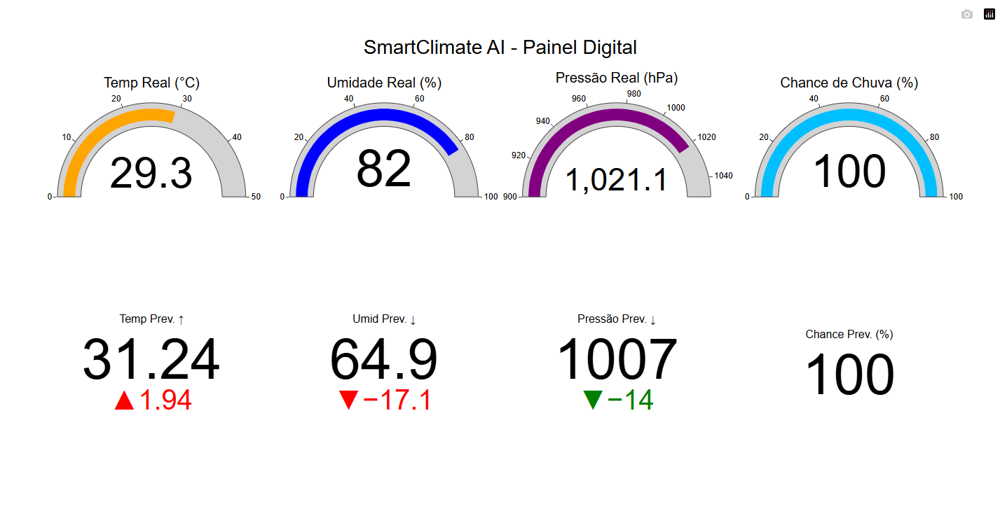

📡 SmartClimate AI

Sistema de estação meteorológica inteligente com sensores físicos, armazenamento em nuvem, inteligência artificial para previsão climática e painel web interativo em tempo real.

O projeto coleta dados ambientais usando ESP8266 + sensores, envia para a nuvem (ThingSpeak) e utiliza IA (Facebook / Meta Prophet) para prever o clima futuro e exibir tudo em um dashboard visual.

🧠 O que o projeto faz

Mede temperatura, umidade e pressão atmosférica

Armazena os dados na nuvem (ThingSpeak)

Usa IA para prever:

Temperatura futura

Umidade futura

Pressão futura

Chance de chuva

Exibe tudo em um painel digital interativo

🖥️ Painel Final

Esta é a versão final do dashboard, gerada pelo arquivo:

dashboard_interativo_2_X_4_final.py

### 🖥️ Visual do painel

Imagem real do sistema rodando:

⚙️ Tecnologias usadas
Hardware

ESP8266 NodeMCU

Sensor DHT11 (Temperatura e Umidade)

Sensor BMP180 (Pressão)

Software

Python

Pandas

Requests

Plotly Dash

Facebook / Meta Prophet (IA de previsão)

ThingSpeak (nuvem)

HTML + JavaScript (dashboard)

📂 Estrutura do projeto
SmartClimateAI/
│
├── arduino/
│   └── Smartclimate/
│       └── Smartclimate.ino
│
├── download.py
├── climate.csv
├── dashboard_interativo_2_X_4_final.py   ← Versão final do sistema
├── README.md

🔄 Fluxo do sistema
Sensores → ESP8266 → ThingSpeak → Python → IA (Prophet) → Dashboard Web

🚀 Como rodar o projeto
1️⃣ Baixar os dados do ThingSpeak
python download.py

Isso gera:

climate.csv

2️⃣ Rodar o painel com IA
python dashboard_interativo_2_X_4_final.py

Depois abra no navegador:

http://127.0.0.1:8050

🤖 Inteligência Artificial

O projeto usa o Prophet, uma biblioteca de previsão criada pelo Facebook (Meta), especializada em séries temporais.

Ela analisa os dados do clima e aprende:

Tendências

Ciclos

Padrões climáticos

E gera previsões automaticamente.

🧑‍💻 Autor

Projeto desenvolvido por Renan Ferreira
Estação meteorológica com IA real, sensores físicos e painel profissional.